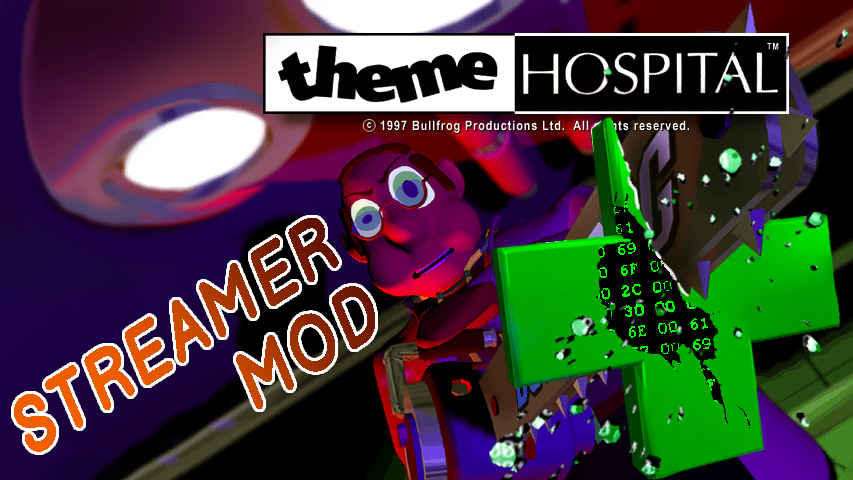

# Theme Hospital Streamer Mod



## Description

This mod gives ability to trigger some in-game events such as:
  - Earthquake
  - Emergency
  - VIP
  - Epidemic (for now Windows only)
  - Breaking boiler
  - Vomit virus

Also you can unlock the camera position limit and make your patients piss themselves or leave the hospital.

## Usage

This mod requires you to have an original Theme Hospital game. It will not work with CorsixTH.

Windows version of this mod was created using Theme Hosptital 1.0.0.1
DOSBox (0.74) version was made using Theme Hospital from [Electronic Arts Store](https://www.ea.com/games/theme/theme-hospital)

Because game doesn't have the modding system this mod is made as a DLL.
To use this mode you need to know how inject DLL into the game proccess.

This mode creates the WebSocket server which listens for commands and interact with the game memory at runtime.
To send commands you will need to have a WebSocket client and know how to use it.

DLL and it's config files should be placed in the same folder as executables, Hospital.exe for Windows version or DOSBox.exe for DOS version.  

## Configuration

Main config file is ThemeHospital_StreamerMod[_DOSBox]_config.json
It contains config for WebSocket server and path to file with memory offsets.
```
{
  "wsConfig": {
    "Host": "127.0.0.1",
    "Port": "9099"
  },
  "gameOffsetsFilename": "ThemeHospital_StreamerMod_offsets.json"
}
```

## WebSocket message

```
Message
{
    string ID           // Unique identifier for message, optional
    string CommandName  // Name of the command from list
    string Command      // Command body with config params
}
```

## Commands

Available commands:
```
enum Commands
{
  Unknown,
  Close,        // Uninject DLL, didn't implement
  UnlockCamera, // Unlock camera movement
  Quake,
  Emergency,
  VIP,
  Disaster,
  Epidemic,     // Windows only for now
  Piss,
  Leave
};
```

# Close

Sends command to uninject DLL from the game with given exit code. Currently doesn't do anything.

```
CommandClose
{
  string Name; // Close
  int Code;    // Exit code for the thread
}
```

# UnlockCamera

Sends command to change limit of camera position, so you can move camera to any part of the map.

```
UnlockCameraCommand
{
}
```

# Quake

Sends command to replace current settings for next earthquake with a new one with your parameters.

```
QuakeCommand
{
  string Name;    // Quake
  int GameClock;  // Value of internal game clocks (1 day = 50 ticks)
  int Severity;   // Severity of the quake (how much damage to machines)
  bool Enabled;
}
```

# Emergency

```
EmergencyCommand
{
  string Name;      // Emergency
  uint16_t Bonus;   // Reward per saved patient
  uint8_t Illness;  // Illness index 
  uint8_t Amount;   // Amount of patients
  uint8_t PercWin;  // How many percents need to be cured to count as passed
}

```
# VIP

```
VIPCommand
{
  :string Name;     // VIP
  :string Username; // Custom name of the VIP. It will be displayed in the game
  int Score;        // Score for the hospital (0-14) 0 - highest, 14 - lowest
}
```

# Disaster

```
enum DisasterType : uint8_t
{
	NoDisaster,
	BoilerDown,
	BoilerUp,
	VomitWave
};

DisasterCommand
{
  string Name;  // Disaster
  uint8_t Type; // One of the values from enum DisasterType
}
```

# Epidemic

```
EpidemicCommand
{
  string Name;      // Epidemic
  uint8_t Disease;  // Which disease to use
  uint8_t Amount;   // How many patients to spawn
}
```

# Piss

```
{
  std::string Name; // Piss
  int Duration;     // Duration of the event in game days
}
```

# Leave

```
{
  std::string Name; // Leave
  int Duration;     // Duration of the event in game days
}
```
